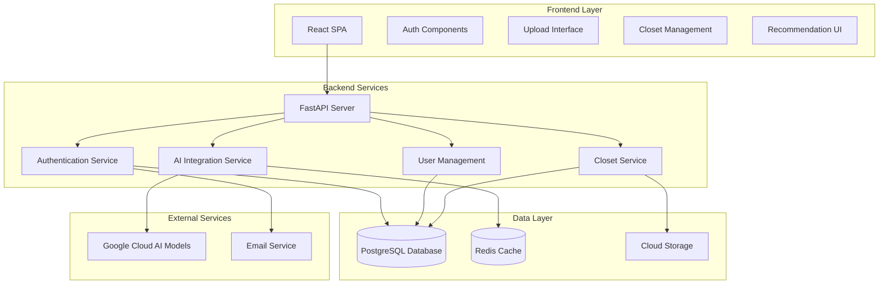

# Design Document

## Overview

The production fashion platform will transform the existing local prototype into a scalable, secure, multi-user system. The architecture follows a modern web application pattern with separate frontend and backend services, cloud-based AI model integration, and robust data persistence.

### Key Design Principles
- **Security First**: All user data and interactions are secured with industry-standard practices
- **Scalability**: Architecture supports horizontal scaling for growing user base
- **Modularity**: Clear separation of concerns between authentication, AI processing, and data management
- **Performance**: Optimized for fast response times and efficient resource usage
- **Testability**: All components designed with comprehensive testing in mind

## Architecture

### High-Level Architecture



### Technology Stack

**Frontend:**
- React 18 with TypeScript for type safety
- React Router for navigation
- React Query for server state management
- Tailwind CSS for styling
- Vite for build tooling

**Backend:**
- FastAPI (Python) for high-performance API
- SQLAlchemy ORM for database operations
- Alembic for database migrations
- Pydantic for data validation
- JWT for authentication tokens
- Celery for background tasks

**Database & Storage:**
- PostgreSQL for primary data storage
- Redis for caching and session storage
- AWS S3 or Google Cloud Storage for image storage
- Vector database (Pinecone or Weaviate) for embedding similarity search

**AI & ML:**
- Google Cloud AI Platform for model hosting
- CLIP model for local embedding generation
- Vector similarity search for outfit matching

**Infrastructure:**
- Docker containers for deployment
- Nginx for reverse proxy and static file serving
- Monitoring with Prometheus and Grafana
- Logging with structured JSON logs

## Components and Interfaces

### Authentication Service

**Purpose**: Handle user registration, login, password management, and session control.

**Key Components:**
- `UserRegistration`: Handle new user signup with email verification
- `UserAuthentication`: Login/logout with JWT token management
- `PasswordManager`: Secure password hashing and reset functionality
- `SessionManager`: Manage user sessions and token refresh

**API Endpoints:**
```python
POST /auth/register
POST /auth/login
POST /auth/logout
POST /auth/refresh-token
POST /auth/forgot-password
POST /auth/reset-password
GET /auth/verify-email/{token}
```

### User Management Service

**Purpose**: Manage user profiles, style preferences, and quiz responses.

**Key Components:**
- `UserProfile`: Store and update user information
- `StyleQuiz`: Handle quiz questions and responses
- `StyleProfiler`: Determine AI model assignment based on quiz results
- `PreferenceManager`: Store and update user style preferences

**API Endpoints:**
```python
GET /users/profile
PUT /users/profile
POST /users/style-quiz
GET /users/style-profile
PUT /users/preferences
```

### Closet Management Service

**Purpose**: Handle clothing item uploads, storage, and organization.

**Key Components:**
- `ImageUploader`: Process and validate clothing image uploads
- `EmbeddingGenerator`: Generate CLIP embeddings for clothing items
- `ClosetOrganizer`: Categorize and organize clothing items
- `ItemManager`: CRUD operations for clothing items

**API Endpoints:**
```python
POST /closet/upload
GET /closet/items
DELETE /closet/items/{item_id}
PUT /closet/items/{item_id}
GET /closet/categories
GET /closet/stats
```

### AI Integration Service

**Purpose**: Interface with Google Cloud AI models and handle outfit generation.

**Key Components:**
- `ModelRouter`: Route requests to appropriate AI model based on user profile
- `OutfitGenerator`: Process AI responses and extract outfit components
- `SimilarityMatcher`: Match AI suggestions to user's closet items
- `RecommendationEngine`: Combine AI output with closet matching

**API Endpoints:**
```python
POST /ai/recommend
GET /ai/models
POST /ai/feedback
GET /ai/recommendation-history
```

## Data Models

### User Model
```python
class User(BaseModel):
    id: UUID
    email: str
    password_hash: str
    first_name: str
    last_name: str
    is_verified: bool
    created_at: datetime
    updated_at: datetime
    style_profile_id: Optional[UUID]
    
class StyleProfile(BaseModel):
    id: UUID
    user_id: UUID
    quiz_responses: Dict[str, Any]
    assigned_model: str
    style_preferences: List[str]
    created_at: datetime
    updated_at: datetime
```

### Closet Models
```python
class ClothingItem(BaseModel):
    id: UUID
    user_id: UUID
    filename: str
    original_filename: str
    category: str
    color: Optional[str]
    brand: Optional[str]
    size: Optional[str]
    image_url: str
    embedding: List[float]
    upload_date: datetime
    
class ClothingCategory(BaseModel):
    id: UUID
    name: str
    description: str
    parent_category_id: Optional[UUID]
```

### Recommendation Models
```python
class OutfitRecommendation(BaseModel):
    id: UUID
    user_id: UUID
    prompt: str
    ai_response: str
    recommended_items: List[UUID]
    feedback_score: Optional[int]
    created_at: datetime
    
class RecommendationFeedback(BaseModel):
    id: UUID
    recommendation_id: UUID
    user_id: UUID
    rating: int
    comments: Optional[str]
    created_at: datetime
```

## Error Handling

### Error Categories and Responses

**Authentication Errors (401, 403):**
- Invalid credentials
- Expired tokens
- Insufficient permissions
- Account not verified

**Validation Errors (400, 422):**
- Invalid input data
- Missing required fields
- File format validation
- Image processing errors

**Resource Errors (404, 409):**
- User not found
- Clothing item not found
- Duplicate email registration
- Model not available

**Server Errors (500, 502, 503):**
- Database connection failures
- AI model service unavailable
- File upload failures
- Internal processing errors

### Error Response Format
```json
{
  "error": {
    "code": "VALIDATION_ERROR",
    "message": "Invalid file format",
    "details": {
      "field": "image",
      "allowed_formats": ["jpg", "jpeg", "png"]
    },
    "timestamp": "2025-01-08T10:30:00Z",
    "request_id": "req_123456"
  }
}
```

### Retry and Fallback Strategies

**AI Model Integration:**
- Retry failed requests with exponential backoff
- Fallback to alternative models if primary model unavailable
- Cache successful responses to reduce API calls

**Database Operations:**
- Connection pooling with automatic retry
- Read replicas for improved performance
- Graceful degradation for non-critical features

**File Upload:**
- Chunked upload for large files
- Resume capability for interrupted uploads
- Multiple storage backend support

## Testing Strategy

### Unit Testing
- **Coverage Target**: Minimum 80% code coverage
- **Framework**: pytest for backend, Jest for frontend
- **Focus Areas**: Business logic, data validation, utility functions
- **Mocking**: External services (AI models, email, storage)

### Integration Testing
- **API Testing**: All endpoints with various input scenarios
- **Database Testing**: CRUD operations, transactions, constraints
- **Authentication Flow**: Complete user journey testing
- **File Upload**: Image processing and storage workflows

### End-to-End Testing
- **User Workflows**: Registration → Quiz → Upload → Recommendations
- **Cross-browser Testing**: Chrome, Firefox, Safari compatibility
- **Mobile Responsiveness**: Touch interactions and responsive design
- **Performance Testing**: Load times and user experience metrics

### Security Testing
- **Authentication**: Token validation, session management
- **Authorization**: Access control and permission checks
- **Input Validation**: SQL injection, XSS prevention
- **File Upload Security**: Malicious file detection, size limits

### Performance Testing
- **Load Testing**: Concurrent user simulation
- **Stress Testing**: System limits and breaking points
- **AI Model Performance**: Response time benchmarks
- **Database Performance**: Query optimization and indexing

### Test Data Management
- **Fixtures**: Consistent test data across environments
- **Factories**: Dynamic test data generation
- **Cleanup**: Automated test data cleanup
- **Isolation**: Tests don't interfere with each other

### Continuous Integration
- **Automated Testing**: All tests run on every commit
- **Quality Gates**: Code coverage and security scan requirements
- **Deployment Testing**: Staging environment validation
- **Monitoring**: Test result tracking and alerting